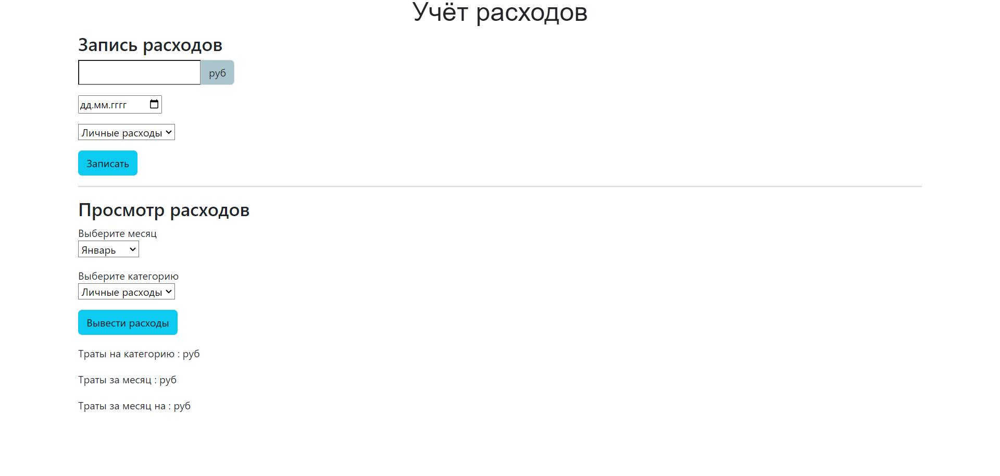
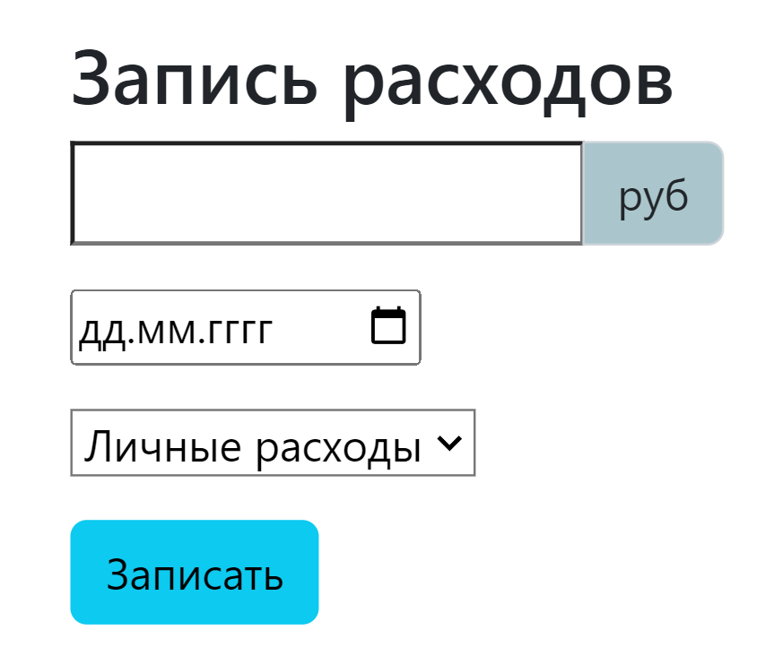
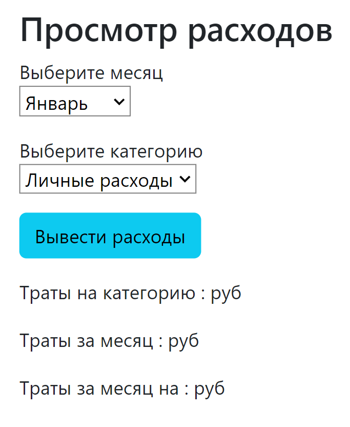

<h1 align="center">FINANCIAL SYSTEM 🏦 </h1>

---

Название:
: Система финансов

Разработчик:
: Лисёнкова Светлана

**Суть проекта**

Данный сайт поможет вам учитывать расходы, которые вы можете посмотреть на любую дату и по любой категории. Все расходы очень тяжело держать в памяти, но мой проект поможет вам хранить их так, чтоб ничего не потерять.

---

## Руководство пользователя

После установки проекта необходимо открыть файл `📁Expenses.php` и вписать[^1] ваш хост, название базы данных, имя пользователя и пароль от него.
[^1]:на 33 строке

```
33        R::setup('mysql:host=;dbname=', '', '');
```

Далее нужно запустить файл `📁index.html`


Если вы хотите вписать расходы, то нужно указать сумму, дату и категорию. 📝

</p>
Для просмотра расходов нужно выбрать месяц и/или категорию.
Ниже можно увидеть расходы по:

- категории
- дате
- дате и категории

</p>
